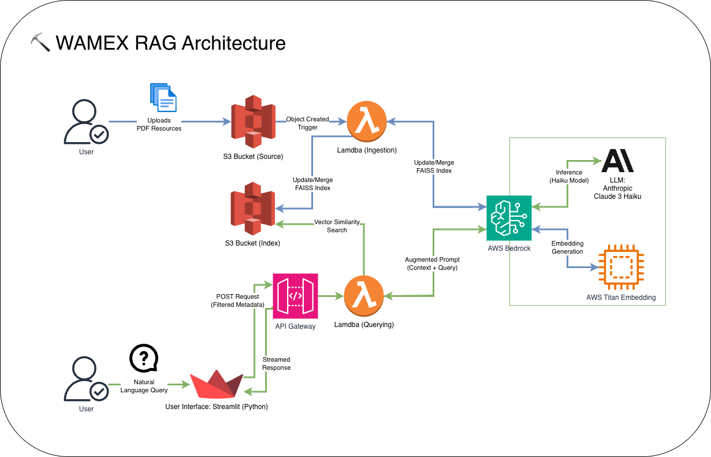
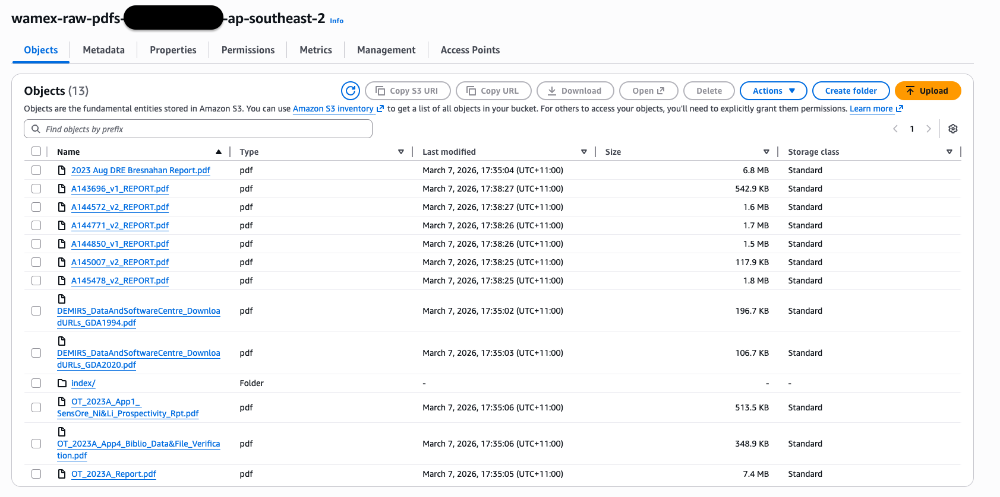
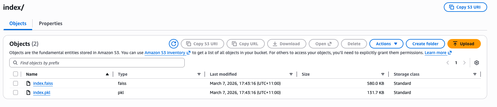
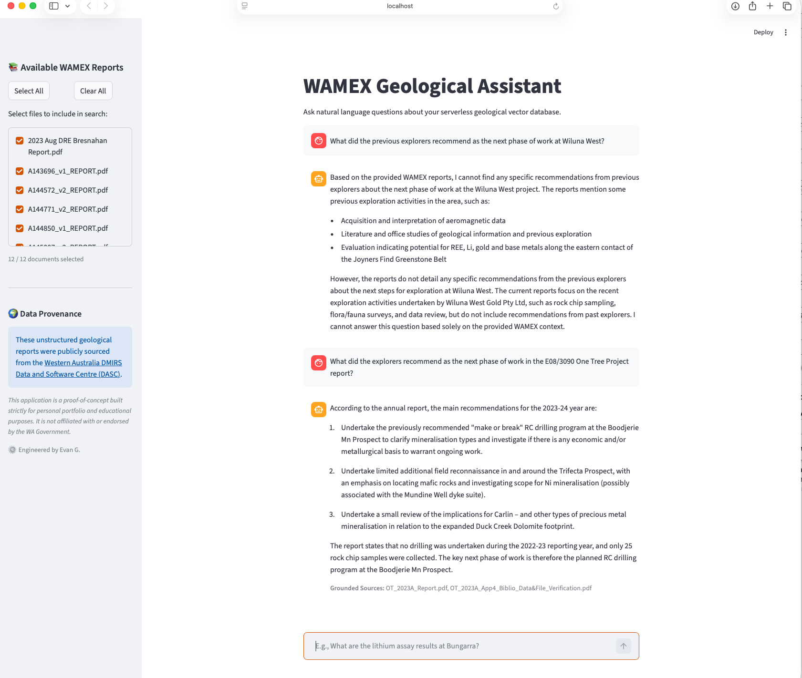
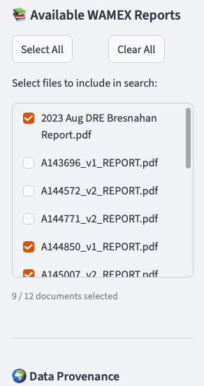

# WAMEX RAG Assistant: Serverless Enterprise GenAI Pipeline
An event-driven, 100% serverless Retrieval-Augmented Generation (RAG) architecture deployed on AWS. This pipeline automatically ingests, chunks, and vectorizes unstructured geological data (WAMEX reports) to ground Large Language Models in domain-specific context, featuring a dynamic Streamlit frontend with document-level metadata filtering.

## 🎯 Executive Summary
This project demonstrates a production-ready approach to Generative AI, focusing on scalable infrastructure, strict FinOps principles, and automated data pipelines. By replacing expensive managed vector databases with an ephemeral, S3-backed FAISS index, this architecture achieves true zero-idle-cost scale while maintaining sub-second retrieval times.

It serves as the unstructured AI counterpart to structured big data processing pipelines (such as PySpark/Apache Iceberg data lakehouses), proving out end-to-end data lifecycle management.

## 🏗️ Architecture & Pipeline


*High-level System Architecture*

1. Event-Driven Ingestion (🔵 The "Writer")
* **Trigger:** Native `s3:ObjectCreated:*` events automatically invoke the pipeline the moment a raw geological report (PDF) is uploaded.
* **Compute:** An AWS Lambda function (Python 3.11 / ARM64) intercepts the file, utilizing LangChain to parse and logically chunk the unstructured text for optimal retrieval.
* **Embedding Generation:** The Lambda invokes Amazon Bedrock (Titan Embeddings) to convert the text chunks into high-dimensional vector representations.
* **Stateless Vector Storage:** To maintain a $0.00 scale-to-zero cost model, the existing FAISS index is dynamically downloaded from the S3 Index bucket, merged with the new document vectors in-memory, and safely overwritten back to S3.

2. Retrieval & Generation (🟢 The "Reader")
* **Frontend:** A pure Python Streamlit application that provides a conversational interface alongside a "NotebookLM-style" sidebar for dynamic document selection (Metadata Filtering).
* **API Layer:** An Amazon API Gateway exposes a secure, RESTful `POST` endpoint to bridge the Streamlit UI with the backend compute.
* **Vector Similarity Search:** A dedicated Querying Lambda function pulls the persistent FAISS index from S3, filters the search space based on the user's sidebar selections, and retrieves the most mathematically relevant text chunks.
* **Grounded Synthesis:** The Lambda constructs an augmented prompt (User Query + Retrieved Context) and streams it to Amazon Bedrock (Anthropic Claude 3 Haiku) to generate a highly accurate, hallucination-free geological insight.

## 💡 Key Engineering Decisions
- FinOps Optimization: Opted for a serverless S3/FAISS architecture over Amazon OpenSearch Serverless, completely eliminating hourly idle database costs.
- Metadata Filtering: Implemented source-level tagging during ingestion, allowing the UI to dynamically restrict the LLM's search space to user-selected documents, ensuring perfect data provenance.
- Stateless Merging: Designed the ingestion Lambda to intelligently download, merge, and re-upload the FAISS index, solving the classic serverless "overwrite" race condition.

## 🛠️ Technology Stack
- Cloud Provider: AWS (100% Serverless)
- Infrastructure as Code (IaC): AWS Serverless Application Model (SAM)
- AI/ML Frameworks: LangChain, Amazon Bedrock (Claude 3 Haiku, Titan V2), FAISS
- Compute & API: AWS Lambda (Python 3.11), Amazon API Gateway, Amazon S3
- Frontend: Streamlit, Boto3
- Dependency Management: Poetry

## 📂 Repository Structure

```Plaintext
wamex-rag-assistant/
├── frontend/
│   └── app.py            # Streamlit UI with S3 dynamic sidebar
├── src/
│   ├── api/              # Lambda: API Gateway integration & Claude 3 generation
│   └── ingestion/        # Lambda: S3 event trigger, parsing, & FAISS merging
├── docs/                 # Infrastructure setup and deployment playbooks
├── pyproject.toml        # Poetry dependency management
└── template.yaml         # AWS SAM CloudFormation blueprint
```

## 🚀 Quick Start
For full instructions on bootstrapping the AWS environment, setting up Bedrock model access (Marketplace EULAs), and deploying the SAM architecture, refer to the [Infrastructure Setup Guide](docs/infrastructure-setup.md).

To run the frontend UI locally:

```Bash
poetry install --with frontend
poetry run streamlit run frontend/app.py
```

### Phase 1: Event-Driven Ingestion
When a geological report is uploaded to the raw data bucket, an AWS Lambda function is automatically triggered to parse, chunk, and vectorize the content.

| Raw S3 Uploads | FAISS Index Storage |
| :--- | :--- |
|  |  |
*Left: The raw WAMEX PDF reports. Right: The persistent FAISS vector store generated by the ingestion pipeline.*

### Phase 2: Retrieval & Generation
The Streamlit frontend allows users to interact with the grounded AI assistant. The sidebar provides a "NotebookLM-style" interface for dynamic document selection.



*The main chat interface showing a grounded response from Claude 3 Haiku.*



*The dynamic sidebar allows for real-time metadata filtering of the search space.*

### 📸 Technical Walkthrough
1. The User Interface
The frontend is built with Streamlit, featuring a NotebookLM-style sidebar for dynamic data provenance control. Users can check/uncheck specific reports to instantly filter the AI's search space.
    
    *The main chat interface showing a technical answer grounded in geological data.*
    
    *The dynamic sidebar allows users to restrict the AI to specific tenements or reports.*

2. The Serverless Backend
By treating S3 as a stateless disk for the FAISS index, this architecture avoids the high monthly costs of a managed vector database.

### 🧪 Verified Technical Queries
To test the grounding of the system, try the following queries:

* **Summarization:** `"Can you summarize the annual report from Wiluna West Gold LTD?"`
* **Technical Extraction:** `"Does the report mention any structural controls, such as faulting or shearing, that influence the gold distribution?"`
* **Strategic Insight:** `"What did the previous explorers recommend as the next phase of work for the One Tree Project?"`

### 🛠️ Infrastructure & Security
* **Compute:** AWS Lambda running Python 3.11 on ARM64 (Graviton) for a 40% better price-performance ratio.
* **Security:** IAM Identity Center (SSO) with short-lived session tokens and STS identity verification.
* **FinOps:** Scale-to-zero model with no fixed monthly costs.

For detailed setup instructions, including AWS SSO authentication and Amazon Bedrock EULA acceptance, see the Infrastructure Setup Guide.

## 🌍 Data Provenance & Disclaimer
These unstructured geological reports were publicly sourced from the [Western Australia DMIRS Data and Software Centre (DASC)](https://dasc.dmirs.wa.gov.au/).

*This application is a proof-of-concept built strictly for personal portfolio and educational purposes. It is not affiliated with or endorsed by the WA Government.*

⚙️ Engineered by Evan G.

## 📄 License

This project is licensed under the MIT License - see the [LICENSE](LICENSE) file for details.