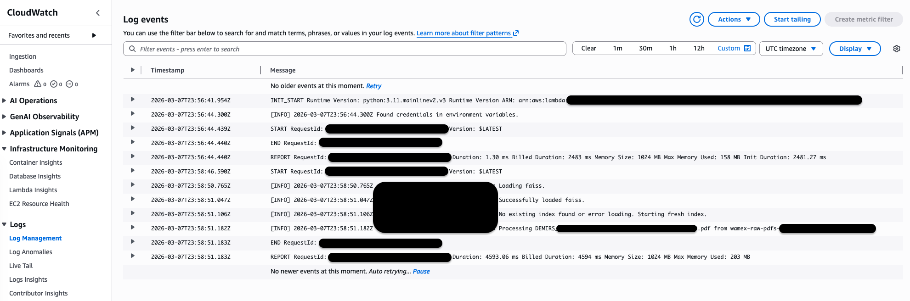

# WAMEX RAG Assistant: Serverless Enterprise GenAI Pipeline
An event-driven, 100% serverless Retrieval-Augmented Generation (RAG) architecture deployed on AWS. This pipeline automatically ingests, chunks, and vectorizes unstructured geological data (WAMEX reports) to ground Large Language Models in domain-specific context, featuring a dynamic Streamlit frontend with document-level metadata filtering.

## 🎯 Executive Summary
This project demonstrates a production-ready approach to Generative AI, focusing on scalable infrastructure, strict FinOps principles, and automated data pipelines. By replacing expensive managed vector databases with an ephemeral, S3-backed FAISS index, this architecture achieves true zero-idle-cost scale while maintaining sub-second retrieval times.

It serves as the unstructured AI counterpart to structured big data processing pipelines (such as PySpark/Apache Iceberg data lakehouses), proving out end-to-end data lifecycle management.

### 📽️ Project Overview (Slide Deck)
A 6-slide overview covering system architecture, automated recovery logs, and retrieval tuning results ($k=20$):
👉 **[Download the Architecture & Demo Slides (PDF)](docs/WAMEX-RAG-Assistant-Deck.pdf)**

## 🏗️ Architecture & Pipeline


*High-level System Architecture*

1. Event-Driven Ingestion (🔵 The "Writer")
* **Trigger & Decoupling:** Native `s3:ObjectCreated:*` events automatically notify an Amazon SQS Main Queue the moment a raw geological report (PDF) is uploaded. This asynchronous decoupling acts as a shock absorber to prevent downstream API throttling.
* **Compute & Chunking:** An AWS Lambda function (Python 3.11 / ARM64) actively polls the SQS queue, intercepting the file and utilizing LangChain to parse and logically chunk the unstructured text for optimal retrieval. Failed messages are automatically redriven, and permanently corrupted files are routed to a Dead Letter Queue (DLQ) to ensure zero data loss.
* **Embedding Generation:** The AWS Lambda invokes Amazon Bedrock (Titan Embeddings) to convert the text chunks into high-dimensional vector representations.
* **Stateless Vector Storage:** To maintain a scale-to-zero cost model, the existing FAISS index is dynamically downloaded from the S3 Index bucket, merged with the new document vectors in-memory, and safely overwritten back to S3.

2. Retrieval & Generation (🟢 The "Reader")
* **Frontend:** A pure Python Streamlit application that provides a conversational interface alongside a "NotebookLM-style" sidebar for dynamic document selection (Metadata Filtering).
* **API Layer:** An Amazon API Gateway exposes a secure, RESTful `POST` endpoint to bridge the Streamlit UI with the backend compute.
* **Vector Similarity Search:** A dedicated Querying AWS Lambda function pulls the persistent FAISS index from S3, filters the search space based on the user's sidebar selections, and retrieves the most mathematically relevant text chunks.
* **Grounded Synthesis:** The AWS Lambda constructs an augmented prompt (User Query + Retrieved Context) and streams it to Amazon Bedrock (Anthropic Claude 3 Haiku) to generate a highly accurate, hallucination-free geological insight.

## 💡 Key Engineering Decisions
- **Event Decoupling & Resiliency:** Inserted an SQS polling layer between S3 and AWS Lambda. During high-volume ingestion, text chunking can easily overwhelm Bedrock's embedding API limits. SQS gracefully catches `ThrottlingExceptions` and applies an automated backoff-and-retry mechanism, ensuring the pipeline self-heals without manual intervention.
- **FinOps Optimization:** Opted for a serverless S3/FAISS architecture over Amazon OpenSearch Serverless, completely eliminating hourly idle database costs.
- **Metadata Filtering:** Implemented source-level tagging during ingestion, allowing the UI to dynamically restrict the LLM's search space to user-selected documents, ensuring perfect data provenance.
- **Stateless Merging:** Designed the ingestion AWS Lambda to intelligently download, merge, and re-upload the FAISS index, solving the classic serverless "overwrite" race condition.

## 🛡️ Enterprise Security Posture (PoC Considerations): 
While this is a Proof of Concept, several foundational security measures were integrated by design to mitigate common Generative AI vulnerabilities (like Prompt Injection):
- **IAM Least Privilege:** The AWS Lambda execution roles are strictly scoped. The Query Lambda only possesses Read-Only access to the S3 FAISS index and Amazon Bedrock, ensuring the LLM cannot execute malicious infrastructure commands.
- **Context Bounding (Prompt Engineering):** The system prompt strictly anchors the Claude 3 Haiku model to the retrieved geological context. If a user attempts a prompt injection or asks out-of-domain questions, the model is instructed to safely reject the prompt.
- **Frontend Sanitization:** Streamlit natively escapes HTML and JavaScript inputs, neutralizing Cross-Site Scripting (XSS) attempts before they reach the backend processing logic.
- **Production Migration Path:** For a production deployment, this architecture is designed to seamlessly integrate with Guardrails for Amazon Bedrock to provide an API-level firewall for PII masking and prompt injection blocking.
 
## 🚀 Enterprise Scaling & Day-Two Operations Roadmap
This architecture is intentionally designed as a lightweight, scale-to-zero Proof of Concept. For a production-grade deployment serving a global enterprise, I would introduce the following enhancements:

* **Managed Vector Database (Amazon OpenSearch Serverless):** Migrating from the stateless S3 FAISS index to OpenSearch as the document corpus scales into the millions. This unlocks advanced hybrid search capabilities (lexical + semantic) and allows for fine-grained, document-level Role-Based Access Control (RBAC).
* **Automated Alerting (Amazon SNS):** Attaching an SNS topic to the SQS Dead Letter Queue (DLQ). Instead of relying on manual CloudWatch log audits, administrators would receive real-time email or Slack notifications whenever a corrupted or password-protected PDF fails ingestion, enabling proactive support.


## 🛠️ Technology Stack
- **Cloud Provider:** AWS (100% Serverless)
- **Infrastructure as Code (IaC):** AWS Serverless Application Model (SAM)
- **AI/ML Frameworks:** LangChain, Amazon Bedrock (Claude 3 Haiku, Titan V2), FAISS
- **Compute, Storage & Messaging:** AWS Lambda (Python 3.11), Amazon API Gateway, Amazon S3, Amazon SQS (Main Queue & DLQ)
- **Frontend:** Streamlit, Boto3
- **Dependency Management:** Poetry

## 📂 Repository Structure

```Plaintext
wamex-rag-assistant/
├── frontend/
│   └── app.py            # Streamlit UI with S3 dynamic sidebar
├── src/
│   ├── api/              # AWS Lambda: API Gateway integration & Claude 3 generation
│   └── ingestion/        # AWS Lambda: S3 event trigger, parsing, & FAISS merging
├── docs/                 # Infrastructure setup and deployment playbooks
├── pyproject.toml        # Poetry dependency management
└── template.yaml         # AWS SAM CloudFormation blueprint
```

## 🚀 Quick Start
For full instructions on bootstrapping the AWS environment, setting up Bedrock model access (Marketplace EULAs), and deploying the SAM architecture, refer to the [Infrastructure Setup Guide](docs/infrastructure-setup.md).

To run the frontend UI locally:

```Bash
poetry install --with frontend
poetry run streamlit run frontend/app.py
```

### Phase 1: Event-Driven Ingestion
When a geological report is uploaded to the raw data bucket, an AWS Lambda function is automatically triggered to parse, chunk, and vectorize the content.

| Raw S3 Uploads | FAISS Index Storage |
| :--- | :--- |
|  |  |
*Left: The raw WAMEX PDF reports. Right: The persistent FAISS vector store generated by the ingestion pipeline.*

#### ⚡ Performance & Observability
This architecture is highly optimized for cost and speed. Below is a snapshot of the AWS CloudWatch logs demonstrating the event-driven AWS Lambda function successfully processing a geological report, generating Bedrock embeddings, and merging the FAISS index.



#### 🛡️ Resiliency & Error Handling (SQS Redrive)
During high-volume ingestion, the pipeline may encounter `ThrottlingException` errors from the Amazon Bedrock API. To handle this, I implemented an SQS-based decoupling layer that automatically manages retries.

| ❌ 1. Throttling Failure | ✅ 2. Automated Recovery |
| :--- | :--- |
|  |  |

* **Self-Healing:** The first attempt (left) failed due to API rate limits. SQS held the message and applied a backoff. [cite_start]The second attempt (right) successfully processed the same file (`A143696_v1_REPORT.pdf`) without manual intervention. 
* [cite_start]**Observability:** This granular logging allows for clear traceability of document processing across multiple AWS Lambda invocations.

* **Execution Speed:** Takes under 5 seconds to fully chunk, embed, and index a document.
* **Lean Compute:** Max memory used is ~203 MB, keeping the serverless footprint incredibly cost-effective.
* **Resiliency:** The SQS integration successfully catches Bedrock API rate limits (`ThrottlingException`) and automatically redrives the message, ensuring zero data loss during high-volume uploads.

### Phase 2: Retrieval & Generation
The Streamlit frontend allows users to interact with the grounded AI assistant. The sidebar provides a "NotebookLM-style" interface for dynamic document selection.


*The main chat interface showing a grounded response from Claude 3 Haiku.*


*The dynamic sidebar allows for real-time metadata filtering of the search space.*

### 📸 Technical Walkthrough
1. The User Interface
The frontend is built with Streamlit, featuring a NotebookLM-style sidebar for dynamic data provenance control. Users can check/uncheck specific reports to instantly filter the AI's search space.
    
    *The main chat interface showing a technical answer grounded in geological data.*
    
    *The dynamic sidebar allows users to restrict the AI to specific tenements or reports.*

2. The Serverless Backend
By treating S3 as a stateless disk for the FAISS index, this architecture avoids the high monthly costs of a managed vector database.

### 🧪 Verified Technical Queries
To test the grounding of the system, try the following queries:

* **Summarization:** `"Can you summarize the annual report from Wiluna West Gold LTD?"`
* **Technical Extraction:** `"Does the report mention any structural controls, such as faulting or shearing, that influence the gold distribution?"`
* **Strategic Insight:** `"What did the previous explorers recommend as the next phase of work for the One Tree Project?"`

### 🛠️ Infrastructure & Security
* **Compute:** AWS Lambda running Python 3.11 on ARM64 (Graviton) for a 40% better price-performance ratio.
* **Security:** IAM Identity Center (SSO) with short-lived session tokens and STS identity verification.
* **FinOps:** Scale-to-zero model with no fixed monthly costs.

For detailed setup instructions, including AWS SSO authentication and Amazon Bedrock EULA acceptance, see the Infrastructure Setup Guide.

## 🧠 Lessons Learned & Architectural Trade-offs
1. Designing for Asynchronous Resiliency
    * **Situation** Initially, the pipeline triggered AWS Lambda directly from S3. While simpler, this created a "fragile" link when processing batches of files, as Amazon Bedrock's embedding APIs have strict concurrency limits.
    * **The Lesson:** Decoupling with Amazon SQS is mandatory for production-grade GenAI. It allowed the system to catch `ThrottlingExceptions`, wait for the API to cool-down, and retry automatically without losing a single document.

2. Strategic Infrastructure: Scale-to-Zero vs. Enterprise Managed Services
    * **Situation** During the design phase, I evaluated **Amazon OpenSearch Serverless** for vector storage. While OpenSearch is the clear choice for global enterprise solutions requiring multi-tenancy and million-document scale, its minimum *always-on* cost footprint was over-engineered for this specific geological data PoC.
    * **The Lesson:** Choosing the right tool is a balance of Unit Economics and Operational Complexity. By engineering a stateless S3-backed FAISS index, I achieved sub-5 second performance with a $\$0.00$ *idle cost*. This demonstrates the ability to deliver high-performance AI prototypes without the immediate overhead of managed clusters, while maintaining a clear migration path to OpenSearch as the corpus scales.

3. Balancing Recall vs. Precision (Tuning $k$ and Chunking) 
    * **Situation** In early testing, using a standard $k=5$ (retrieving only the top 5 chunks) led to incomplete answers, especially for dense geological reports where relevant data is spread across multiple tables and sections.
    * **The Lesson:** *One size fits all* retrieval fails for complex domain data. I found that increasing retrieval to $k=20$, combined with specific overlapping chunks ($1000$ tokens / $150$ overlap), significantly improved the LLM's ability to synthesize assay results and drill-hole coordinates without losing context between segments. 

## 🌍 Data Provenance & Disclaimer
These unstructured geological reports were publicly sourced from the [Western Australia DMIRS Data and Software Centre (DASC)](https://dasc.dmirs.wa.gov.au/).

*This application is a proof-of-concept built strictly for personal portfolio and educational purposes. It is not affiliated with or endorsed by the WA Government.*

⚙️ Engineered by Evan G.

## 📄 License

This project is licensed under the MIT License - see the [LICENSE](LICENSE) file for details.