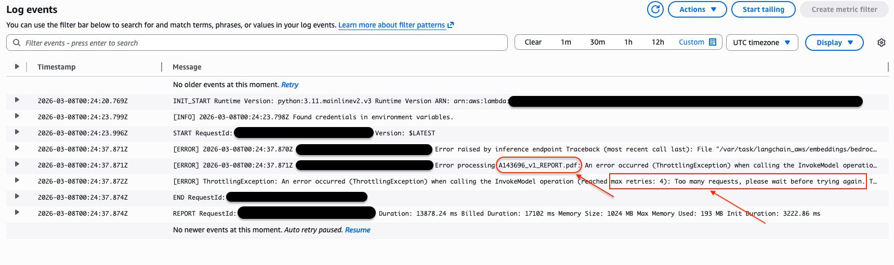
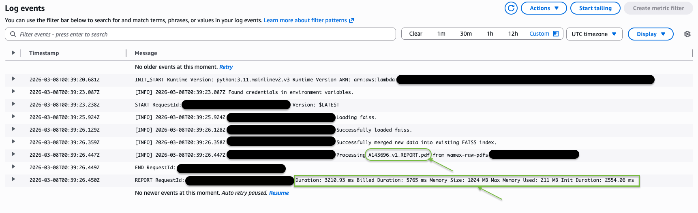

# WAMEX RAG Assistant: Serverless Enterprise GenAI Pipeline

An event-driven, 100% serverless Retrieval-Augmented Generation (RAG) architecture deployed on AWS. This pipeline automatically ingests, chunks, and vectorizes unstructured geological data (WAMEX reports) to ground Large Language Models in domain-specific context, featuring a dynamic Streamlit frontend with document-level metadata filtering.

## 🎯 Executive Summary
This project demonstrates a production-ready approach to Generative AI, focusing on scalable infrastructure, strict FinOps principles, and automated data pipelines. By replacing expensive managed vector databases with an ephemeral, S3-backed FAISS index, this architecture achieves true zero-idle-cost scale while maintaining sub-second retrieval times.

It serves as the unstructured AI counterpart to structured big data processing pipelines, proving out end-to-end data lifecycle management.

### 📽️ Project Overview (Slide Deck)
A 6-slide overview covering system architecture, automated recovery logs, and retrieval tuning results ($k=20$):
👉 **[Download the Architecture & Demo Slides (PDF)](docs/WAMEX-RAG-Assistant-Deck.pdf)**

---

## 🏗️ Architecture & Pipeline


*High-level System Architecture*

### Phase 1: Event-Driven Ingestion (🔵 The "Writer")
When a geological report is uploaded to the raw data bucket, an AWS Lambda function is automatically triggered to parse, chunk, and vectorize the content.

* **Trigger & Decoupling:** Native `s3:ObjectCreated:*` events automatically notify an Amazon SQS Main Queue the moment a raw PDF is uploaded. This acts as a shock absorber to prevent downstream API throttling.
* **Compute & Chunking:** An AWS Lambda function (Python 3.11 / ARM64) polls the SQS queue, intercepting the file and utilizing LangChain to parse and logically chunk the text. 
* **Embedding Generation:** The AWS Lambda invokes Amazon Bedrock (Titan Embeddings) to convert the text chunks into vectors.
* **Stateless Vector Storage:** To maintain a scale-to-zero cost model, the existing FAISS index is dynamically downloaded from the S3 Index bucket, merged with the new vectors in-memory, and safely overwritten back to S3.

| Raw S3 Uploads | FAISS Index Storage |
| :--- | :--- |
|  |  |

### Phase 2: Retrieval & Generation (🟢 The "Reader")
* **Frontend:** A pure Python Streamlit application provides a conversational interface alongside a dynamic sidebar for document selection (Metadata Filtering).
* **API Layer:** An Amazon API Gateway exposes a secure, RESTful `POST` endpoint to bridge the Streamlit UI with the backend.
* **Vector Similarity Search:** A Querying AWS Lambda function pulls the persistent FAISS index from S3, filters the search space based on user selections, and retrieves the most relevant chunks.
* **Grounded Synthesis:** The Lambda constructs an augmented prompt and streams it to Amazon Bedrock (Anthropic Claude 3 Haiku) to generate a hallucination-free geological insight.

| Streamlit UI Main Chat | Dynamic Sidebar Selection |
| :--- | :--- |
|  |  |

---

## 🧠 Key Engineering Decisions & Lessons Learned

1. **Designing for Asynchronous Resiliency (SQS Decoupling):** Initially, the pipeline triggered Lambda directly from S3. However, processing batches of files overwhelmed Bedrock's embedding API limits. Inserting an SQS polling layer gracefully catches `ThrottlingExceptions`, applies an automated backoff, and retries without manual intervention.

| ❌ 1. Throttling Failure | ✅ 2. Automated Recovery |
| :--- | :--- |
|  |  |

2. **Strategic FinOps (Scale-to-Zero):** I evaluated Amazon OpenSearch Serverless, but its always-on cost was over-engineered for this PoC. By engineering a stateless S3-backed FAISS index, I achieved sub-5 second performance with a **$0.00 idle cost**.
3. **Balancing Recall vs. Precision:** Standard retrieval (k=5) led to incomplete answers for dense geological reports. Increasing retrieval to k=20 with overlapping chunks (1000 tokens / 150 overlap) significantly improved the LLM's ability to synthesize assay results and drill-hole coordinates.

---

## 🛡️ Enterprise Security & Scaling Roadmap

**Security Posture Built-In:**
* **IAM Least Privilege:** The Query Lambda possesses strictly Read-Only access to the S3 FAISS index and Amazon Bedrock.
* **Context Bounding:** The system prompt securely anchors the Claude 3 Haiku model to the retrieved context, rejecting out-of-domain prompt injections.
* **Frontend Sanitization:** Streamlit natively escapes HTML/JS inputs, neutralizing XSS attempts.

**Day-Two Operations Roadmap:**
For a production-grade enterprise deployment, I would introduce:
* **Managed Vector Database:** Migrating from S3/FAISS to Amazon OpenSearch Serverless as the corpus scales into the millions to unlock fine-grained RBAC.
* **Automated Alerting:** Attaching an Amazon SNS topic to the SQS Dead Letter Queue (DLQ) for real-time Slack/Email alerts on corrupted PDFs.

---

## 🛠️ Technology Stack
* **Cloud Provider:** AWS (100% Serverless)
* **IaC:** AWS Serverless Application Model (SAM)
* **AI/ML:** LangChain, Amazon Bedrock (Claude 3 Haiku, Titan V2), FAISS
* **Compute & Messaging:** AWS Lambda (Python 3.11 / ARM64), API Gateway, Amazon S3, Amazon SQS
* **Frontend:** Streamlit, Boto3
* **Dependency Management:** Poetry

## 📂 Repository Structure

```Plaintext
wamex-rag-assistant/
├── frontend/
│   └── app.py            # Streamlit UI with S3 dynamic sidebar
├── src/
│   ├── api/              # AWS Lambda: API Gateway integration & Claude 3 generation
│   └── ingestion/        # AWS Lambda: S3 event trigger, parsing, & FAISS merging
├── docs/                 # Infrastructure setup and deployment playbooks
├── pyproject.toml        # Poetry dependency management
└── template.yaml         # AWS SAM CloudFormation blueprint
```

## 🚀 Quick Start
For full instructions on bootstrapping the AWS environment, setting up Bedrock model access, and deploying the SAM architecture, refer to the [Infrastructure Setup Guide](docs/infrastructure-setup.md).

To run the frontend UI locally:

```Bash
poetry install --with frontend
poetry run streamlit run frontend/app.py
```

Local run commands go here.

### 🧪 Verified Technical Queries to Test
* **Summarization:** `"Can you summarize the annual report from Wiluna West Gold LTD?"`
* **Technical Extraction:** `"Does the report mention any structural controls, such as faulting or shearing, that influence the gold distribution?"`
* **Strategic Insight:** `"What did the previous explorers recommend as the next phase of work for the One Tree Project?"`

---

## 🌍 Data Provenance & Disclaimer
These unstructured geological reports were publicly sourced from the [Western Australia DMIRS Data and Software Centre (DASC)](https://dasc.dmirs.wa.gov.au/).

*DISCLAIMER: This solution architecture was built as a proof-of-concept for personal portfolio and educational purposes. It is not affiliated with or endorsed by the WA Government. All data queried is from publicly available WAMEX datasets, and no proprietary information was used.*

⚙️ Engineered by Evan G.

## 📄 License
This project is licensed under the MIT License - see the [LICENSE](LICENSE) file for details.